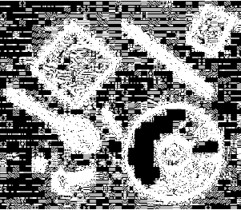
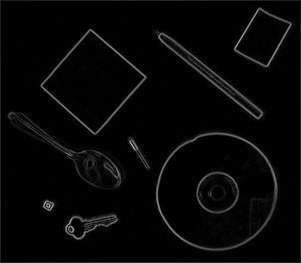
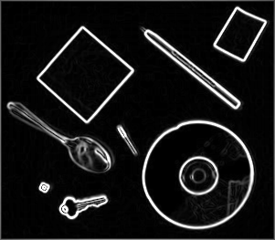
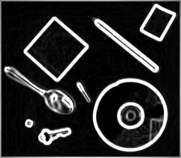
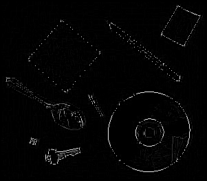
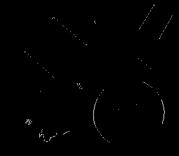
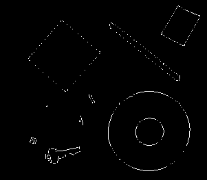
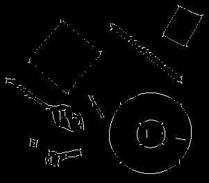

# 🕵️ Canny Edge Detection


> A computer vision project that detects and shows edges using canny edge detection, **Convolution**, **Gradient**, **NonMaximaSuppression**, and **Hystherises Thresholding**.

---

## 📖 Table of Contents
- [✨ Features](#-features)
- [📂 Project Structure](#-project-structure)
- [⚙️ Installation](#️-installation)
- [🚀 Usage](#-usage)
- [📸 Results & Examples](#-results--examples)
  - [Step 1 – Mask in X and Y Directions](#step-1--mask-in-x-and-y-directions)
  - [Step 2 – Gradient](#step-2--gradient)
  - [Step 3 – Non Maxima Suppression](#step-3--non-maxima-suppression)
  - [Step 4 – Hysteresis Thresholding](#step-4--hysteresis-thresholding)
- [🙌 Acknowledgements](#-acknowledgements)

---

## ✨ Features
- ✅ Reads frame sequences (grayscale or RGB).  
- ✅ Computes **mean** & **variance** background models.  
- ✅ Detects changes using Mahalanobis distance.  
- ✅ Applies **erosion** and **dilation**to clean masks.  
- ✅ Extracts connected components (area, centroid, bounding box).  
- ✅ Uses **alpha blending** to gradually remove persons.  
- ✅ Exports **mask video** and **final cleaned video**.  

---

## 📂 Project Structure
```
📦 person-removal-through-change-detection
 ┣ 📂 Input                   # Test Input frames
 ┣ 📂 Output                  # Test Results
 ┣ 📜 main.py                 # Main implementation
 ┣ 📜 Mask.py                 # Main implementation
 ┣ 📜 convolution.py          # Main implementation
 ┣ 📜 gradient.py             # Main implementation
 ┣ 📜 nms.py                  # Main implementation
 ┣ 📜 Hystherises.py          # Main implementation
 ┣ 📜 requirements.txt        # Dependencies
 ┣ 📜 report.pdf              # Report
 ┣ 📜 README.md               # Documentation
```

---

## ⚙️ Installation

1. Clone the repo:
```bash
git clone https://github.com/intelligentMachines-ITU/canny-edge-detector-BlackMamba1122.git
cd canny-edge-detector-BlackMamba1122
```


2. Install dependencies:
```bash
pip install -r requirements.txt
```

---

## 🚀 Usage

Run:
```bash
python main.py --input_file "path_to_input_file" --output_folder "Output/Name" --save_name "name.png"
```
```bash
python main.py --input_file "./Input/name.png" --output_folder "Output/name" --save_name "name.png"

```

Outputs:
- `..._fx_.. .png`          → Mask in X direction
- `..._fy_.. .png`          → Mask in Y direction
- `..._magnitude_.. .png`   → Magnitude
- `...quantize.. .png`      → Quantize
- `...nms.. .png`           → non maxima Suppression
- `...th..tl.. .png`        → Hystherises

---

## 📸 Results & Examples

### Original Image:

### Step 1 – Mask in X and Y directions
- **X Direction**
  
| Sigma 0.5 | Sigma 1.0 | Sigma 2.0 |
|---------|---------|---------|
|  |  |  |

- **Y Direction**
  
| Sigma 0.5 | Sigma 1.0 | Sigma 2.0 |
|---------|---------|---------|
|  |  |  |

---

### Step 2 – Gradient
Magnitude
| Sigma 0.5 | Sigma 1.0 | Sigma 2.0 |
|---------|---------|---------|
|  |  |  |

---

### Step 3 – Non Maxima Suppression
- **Quantize**
  
| Sigma 0.5 | Sigma 1.0 | Sigma 2.0 |
|---------|---------|---------|
|  |  |  |
- **NMS**
  
| Sigma 0.5 | Sigma 1.0 | Sigma 2.0 |
|---------|---------|---------|
|  |  |  | 

---

### Step 4 – Hysteresis Thresholding
Results for different σ values and threshold pairs (Th, Tl).

| σ=0.5 (Th=0.2, Tl=0.1) | σ=0.5 (Th=0.6, Tl=0.3) |
|------------------------|------------------------|
|  |  |

| σ=1.0 (Th=0.2, Tl=0.1) | σ=1.0 (Th=0.6, Tl=0.3) |
|------------------------|------------------------|
|  |  |

| σ=2.0 (Th=0.2, Tl=0.1) | σ=2.0 (Th=0.6, Tl=0.3) |
|------------------------|------------------------|
|  |  |


---


## 🙌 Acknowledgements
- Developed as part of a **Computer Vision Assignment**.  
- Built with ❤️ using **Python, NumPy, Pillow.  
